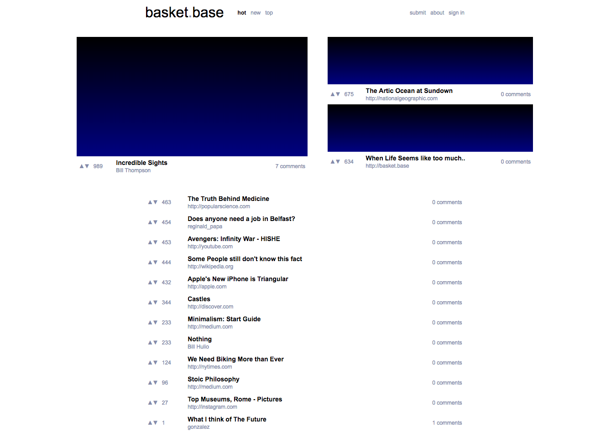

# News/Link Aggregation Platform 

Basketbase is a link aggregator/simple publishing platform ala Reddit. It is light and simple deploy. It's primary design goal is to be minimalist and an example of timeless design, such as the works of Deiter Rams. This is classic style server-rendered application which uses no Javascript whatsoever.

It is written in Racket, and implements it's own session management service. I tried to leverage some of Racket's neatest features including: pattern matching/binding as well the threading operator.

Development is ongoing.
