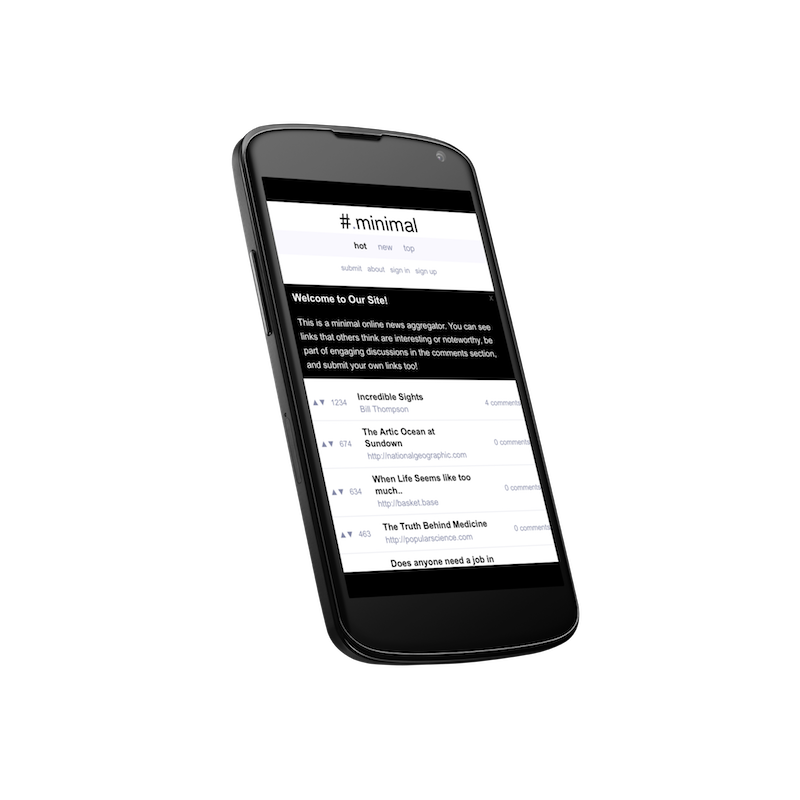

# News/Link Aggregation Platform 


Basketbase is a link aggregator/simple publishing platform ala Reddit. It is light and simple deploy. It's primary design goal is to be minimalist and an example of timeless visual design. This is classic style server-rendered application which uses no Javascript whatsoever.

It is written in Racket, and implements it's own session management service. I tried to leverage some of Racket's neatest features including: pattern matching/binding as well the threading operator.

To get started generate an SQLite database using the **create-db.rkt** script:

```
> racket create-db.rkt
```

And then to start the server simply run:

```
> racket app.rkt
```


